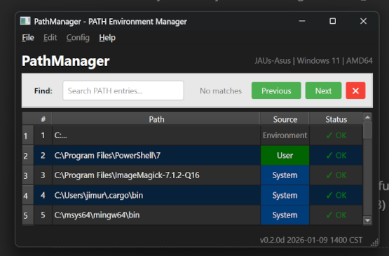

# PathManager Quick Reference Guide

**A fast reference for viewing and managing system PATH environment variables**

---

## ⚡ Essential Quick Start

### Installation

```bash
# Clone repository
git clone https://github.com/juren53/PathManger.git
cd PathManger

# Install GUI dependencies (optional)
pip install -r requirements.txt
```

### Basic Usage

```bash
# View PATH (CLI - default)
python pathmanager.py

# Launch GUI
python pathmanager.py --gui

# Get help
python pathmanager.py --help

# Check version
python pathmanager.py --version
```

### Quick Check

- **Current Version**: v0.2.0d
- **Status**: Phase 1 complete (Basic viewing & GUI)
- **Requirements**: Python 3.7+, PyQt6 for GUI

---

## 📋 Command Reference

| Command                           | Function             | Example                           | Notes            |
| --------------------------------- | -------------------- | --------------------------------- | ---------------- |
| `python pathmanager.py`           | Show PATH in CLI     | `python pathmanager.py`           | Default mode     |
| `python pathmanager.py --gui`     | Launch GUI interface | `python pathmanager.py --gui`     | Requires PyQt6   |
| `python pathmanager.py --help`    | Show help            | `python pathmanager.py --help`    | All options      |
| `python pathmanager.py --version` | Show version         | `python pathmanager.py --version` | Current: v0.2.0d |

### Upcoming Commands (Phase 2+)

| Command            | Status     | Function                      |
| ------------------ | ---------- | ----------------------------- |
| `--check`          | 🚧 Planned | Run problem detection         |
| `--backup-create`  | 📋 Planned | Create manual backup          |
| `--backup-list`    | 📋 Planned | List all backups              |
| `--backup-restore` | 📋 Planned | Restore from backup           |
| `--add <path>`     | 📋 Planned | Add PATH entry                |
| `--remove <path>`  | 📋 Planned | Remove PATH entry             |
| `--clean`          | 📋 Planned | Auto-clean duplicates/missing |

---

## 🖥️ GUI Quick Reference

### Main Window Layout



### Header Layout

- **Left**: "PathManager" title (bold, 16pt)
- **Right**: System info (machine name | OS | hardware)

### Search Bar (Ctrl+F)

- **Find**: Text input field with placeholder "Search PATH entries..."
- **Match counter**: Shows "No matches" or "Match X/Y"  
- **Previous** button: Navigate to previous match
- **Next** button: Navigate to next match  
- **Close (×)** button: Hide search bar

### Table Columns

| Column | Windows | Linux/macOS | Description                    |
| ------ | ------- | ----------- | ------------------------------ |
| #      | ✅       | ✅           | Entry number (1-based)         |
| Path   | ✅       | ✅           | Directory path                 |
| Source | ✅       | ❌           | [U] User PATH, [S] System PATH |
| Status | ✅       | ✅           | ✓ OK or ✗ Not Found            |

### Color Coding

- 🟦 **Light blue background** = System PATH entries
- 🟩 **Light green background** = User PATH entries  
- ✅ **Green check (✓ OK)** = Directory exists
- ❌ **Red X (✗ Not Found)** = Directory missing
- 🔍 **Yellow highlight** = Current search match
- 📖 **Alternating rows** = Better readability

### GUI Controls & Shortcuts

| Action                     | Function             | Shortcut     | Menu Location                |
| -------------------------- | -------------------- | ------------ | ---------------------------- |
| **Quit Application**       | Exit PathManager     | Q (app-wide) | File → Exit (Ctrl+Q)         |
| **Find/Search**            | Show search bar      | Ctrl+F       | File → Find                  |
| **Help - Overview**        | Show README.md       | -            | Help → Overview              |
| **Help - Quick Reference** | Show this guide      | F1           | Help → Quick Reference Guide |
| **Help - Change Log**      | Show version history | -            | Help → Change Log            |
| **Help - About**           | Show about dialog    | -            | Help → About PathManager     |

### Search Features

- **Real-time search**: Results update as you type
- **Navigate matches**: Previous/Next buttons cycle through results
- **Match highlighting**: Current match highlighted in yellow
- **Match counter**: Shows "Match X/Y" format when matches found
- **Case-insensitive**: Search ignores case differences
- **Path-only search**: Searches only in the Path column

### Menu Bar Structure

```
File
├── Find...           (Ctrl+F)
├── ──────────────────
└── Exit              (Ctrl+Q)

Edit                  (Disabled - Coming Phase 4)

Config                (Disabled - Coming Phase 5)

Help
├── Overview
├── Quick Reference Guide  (F1)
├── Change Log
├── ──────────────────
└── About PathManager
```

---

## 🔧 Common Tasks by Role

### 👤 Basic Users

**View your current PATH:**

```bash
python pathmanager.py
```

**Launch GUI for easier viewing:**

```bash
python pathmanager.py --gui
```

**Check for missing directories:**

- Look for `[NOT FOUND]` indicators in CLI
- Look for ❌ symbols in GUI

### 🔧 Power Users

**Understand User vs System PATH:**

- `[U]` = User PATH (per-user, no admin required)
- `[S]` = System PATH (machine-wide, admin required)

**Quick PATH summary:**

```bash
# CLI shows counts at bottom:
# User PATH entries: 12
# System PATH entries: 33
# Combined PATH entries: 45
```

### 👨‍💻 System Administrators

**Current Limitations (v0.2.0d):**

- View-only (no modifications yet)
- No admin elevation required for viewing
- Both User and System PATH visible

**Coming Features (Phases 2-4):**

- Problem detection and auto-fix
- Safe PATH modification with backup
- Bulk operations for multiple systems

---

## ⚠️ Troubleshooting Quick Guide

### Common Issues

#### **GUI Won't Launch**

```bash
# Problem: ImportError: No module named 'PyQt6'
Solution: pip install PyQt6
# OR: pip install -r requirements.txt
```

#### **Permission Denied**

```bash
# Problem: Can't read System PATH
Solution: Run as administrator (for future modification features)
# Note: Reading System PATH currently doesn't require admin
```

#### **PATH Not Updated After Changes**

```bash
# Current issue: Changes not implemented yet
# Coming in Phase 4: Automatic registry broadcasting
```

### Error Messages

| Error                                  | Meaning               | Solution             |
| -------------------------------------- | --------------------- | -------------------- |
| `ImportError: No module named 'PyQt6'` | PyQt6 not installed   | `pip install PyQt6`  |
| `Access denied`                        | Registry access issue | Run as administrator |
| `PATH too long`                        | Windows PATH limit    | Clean up old entries |

### Windows-Specific Issues

#### **Path Length Limits**

- **System PATH**: 8191 characters (Windows 11)
- **User PATH**: 2047 characters (Windows 11)
- **Detection**: Coming Phase 2

#### **Invalid Characters**

- Avoid: `< > " | ? *` in PATH entries
- Detection: Coming Phase 2

#### **UNC Network Paths**

- Format: `\\server\share\folder`
- Valid but may cause delays if offline
- Detection: Coming Phase 2

---

## 🚀 Feature Status by Phase

### ✅ Phase 1 - Complete (v0.2.0d)

- **View PATH** in CLI and GUI
- **Windows registry** integration
- **User vs System PATH** distinction
- **Directory existence** checking
- **Cross-platform** support (Windows/Linux/macOS)

### 🚧 Phase 2 - Problem Detection (Next)

- **Duplicate detection**
- **Non-existent directory warnings**
- **Ordering issues** (shadowed executables)
- **Windows-specific problems**
- **Export reports** (text/JSON)

### 📋 Phase 3 - Backup System

- **Automatic backup** before changes
- **Backup browser** and restore
- **Backup history** management
- **Cross-platform** backup storage

### 📋 Phase 4 - PATH Modification

- **Add/remove/reorder** entries
- **Safe modification** with preview
- **Admin elevation** for System PATH
- **Bulk operations**

### 📋 Phase 5 - Polish & Integration

- **Windows 11 UI** styling
- **System tray** integration
- **Installer** distribution
- **Auto-update** checking

---

## 🖥️ Platform-Specific Notes

### Windows 11 (Primary Platform)

✅ **Fully Supported**

- Reads User and System PATH from registry
- Distinguishes User [U] vs System [S] entries
- Checks directory existence
- No admin rights required for viewing

### Linux

✅ **Basic Support**

- Reads PATH from environment variable
- No User/System distinction (single PATH)
- Standard Unix path separator `:`
- No directory checking in current version

### macOS

✅ **Basic Support**

- Reads PATH from environment variable  
- No User/System distinction
- Standard Unix path separator `:`
- No directory checking in current version

---

## 👨‍💻 Developer Quick Reference

### Architecture Overview

```
PathManager/
├── core/           # Business Logic
│   ├── path_analyzer.py    # PathAnalyzer class
│   └── __init__.py
├── cli/            # CLI Interface  
│   ├── cli_main.py         # CLI functions
│   └── __init__.py
├── gui/            # GUI Interface
│   ├── gui_main.py         # PyQt6 main window
│   ├── widgets/            # Future custom widgets
│   ├── dialogs/            # Future dialog windows
│   └── __init__.py
└── pathmanager.py  # Entry point with argument parsing
```

### Key Classes

| Class               | Location                | Purpose                  |
| ------------------- | ----------------------- | ------------------------ |
| `PathAnalyzer`      | `core/path_analyzer.py` | Read/analyze PATH data   |
| `PathEntry`         | `core/path_analyzer.py` | Single PATH entry object |
| `PathManagerWindow` | `gui/gui_main.py`       | Main PyQt6 window        |

### Development Commands

```bash
# Run CLI
python pathmanager.py

# Run GUI
python pathmanager.py --gui

# Check current version
python pathmanager.py --version
```

### Core Modules - Current State

- **`core/path_analyzer.py`**: ✅ Complete - PATH reading logic
- **`cli/cli_main.py`**: ✅ Complete - CLI interface
- **`gui/gui_main.py`**: ✅ Complete - PyQt6 GUI interface
- **Core modules**: 📋 Planned for Phases 2-5
  - `path_detector.py` - Problem detection
  - `path_modifier.py` - PATH modification
  - `backup_manager.py` - Backup/restore system

### Testing

**Current Testing (Manual):**

```bash
# Test CLI
python pathmanager.py
# Verify: System info, numbered entries, [U]/[S] markers, summary

# Test GUI  
python pathmanager.py --gui
# Verify: Window opens, table displays, status bar shows counts
```

**Coming Testing (Automated):**

- Unit tests for all core modules
- Integration tests for CLI/GUI
- Registry operation tests
- Cross-platform compatibility tests

---

## 📚 Additional Resources

### Project Documentation

- **README.md** - Full project overview and setup guide
- **PLAN_PathManager-project.md** - Detailed 5-phase development roadmap
- **CHANGELOG.md** - Version history and release notes
- **CLAUDE.md** - AI assistant development guidance

### External References

- [Windows PATH Environment Variable](https://docs.microsoft.com/en-us/windows/win32/procthread/environment-variables)
- [PyQt6 Documentation](https://www.riverbankcomputing.com/static/Docs/PyQt6/)
- [Python os.path Module](https://docs.python.org/3/library/os.path.html)

### Version Information

- **Current Version**: v0.2.0d (Phase 1 Complete)
- **Next Release**: v0.3.0 (Phase 2 - Problem Detection)
- **Release Schedule**: Approximately every 2-3 weeks
- **All timestamps use Central Time (CST/CDT)**

---

## 💡 Pro Tips

### CLI Tips

- Use `python pathmanager.py | more` for long PATH listings
- Redirect output to file: `python pathmanager.py > my-path.txt`
- Look for `[NOT FOUND]` indicators to spot broken entries

### GUI Tips

- Resize window to see long paths better
- Status bar shows quick summary (counts by type)
- Color coding: System=blue, User=green, Missing=red X

### General Tips

- PATH is case-insensitive on Windows
- Windows registry changes may need admin privileges (future)
- Always backup before modifying PATH (coming Phase 3)
- Order matters - first match wins for executable lookup

---

**PathManager v0.2.0d** | Phase 1 Complete | Updated 2026-01-09 | Central Time USA (CST)

*For the latest updates and development progress, see the project README and CHANGELOG.*